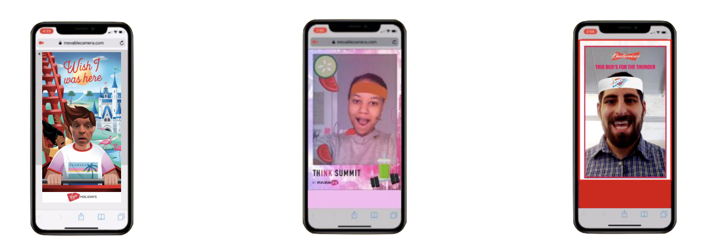

export { default as theme } from '../theme'
import { Image, Appear, Notes } from 'mdx-deck'
import { SplitRight } from 'mdx-deck/layouts'
import PresentButton from '../PresentButton'

# Becoming an AR developer in 3 Easy Steps!*

### _*not really_

## Andrés Cuervo
### ARKit NYC Meetup
#### August 21, 2019

---

I'm an XR artist, software engineer, and HCI researcher.

---

# The Point Of This Talk

- Not to brag!
- To show how circuitous & new all this stuff still is

---

# College (2017)

- B.A.Computer Science & Creative Writing!

- My capstone:

---

# My first job

- Full time engineer at CircleCI
- Hey look, I'm a "real" web developer now!
- ... knew it wasn't the end of the road though.

---

# [ARctober 2017](https://medium.com/@cwervo/arctober-11da399199be)

---

# Google Expressions (2018)

---

# AR @ Movable Ink (2019 — ???)

_([from this article, originally provided via Movable Ink](https://techcrunch.com/2019/02/19/movable-ink-now-gives-marketers-the-ability-to-add-augmented-reality-to-campaigns/))_

---

<h3>Thanks!</h3>
<ul>
    <li><a style={{color: "black"}} href="https://twitter.com/acwervo">@acwervo</a></li>
    <li><a style={{color: "black"}} href="https://cwervo.com">cwervo.com</a></li>
    <li><a style={{color: "black"}} href="https://slides.cwervo.com">slides.cwervo.com</a></li>
    

</ul>

