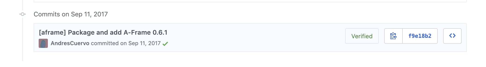
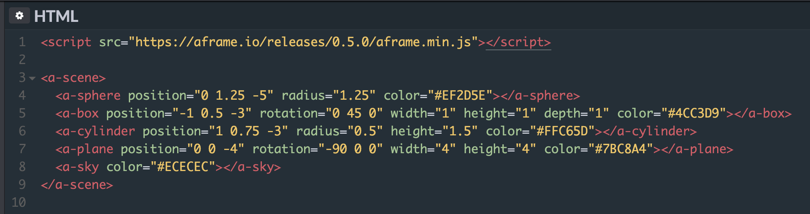
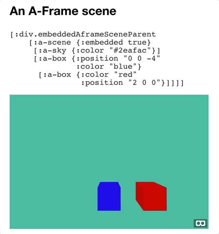
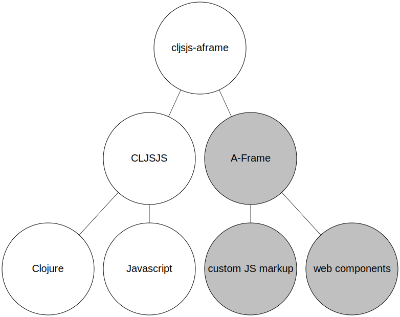
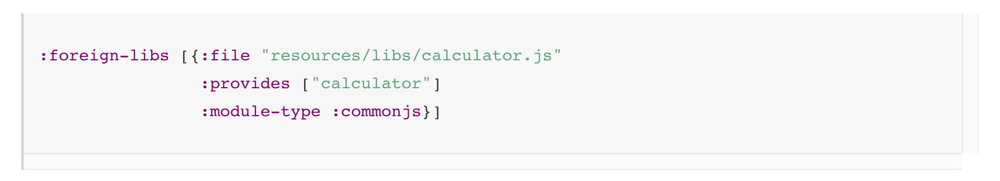
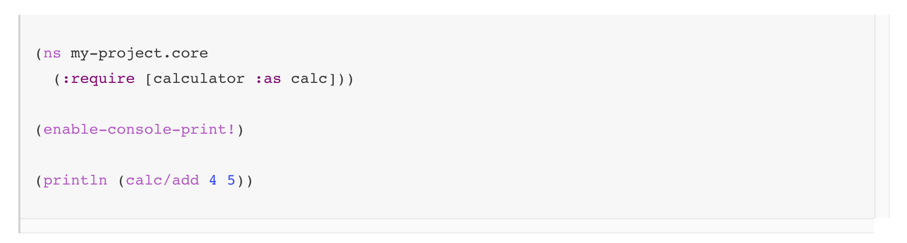
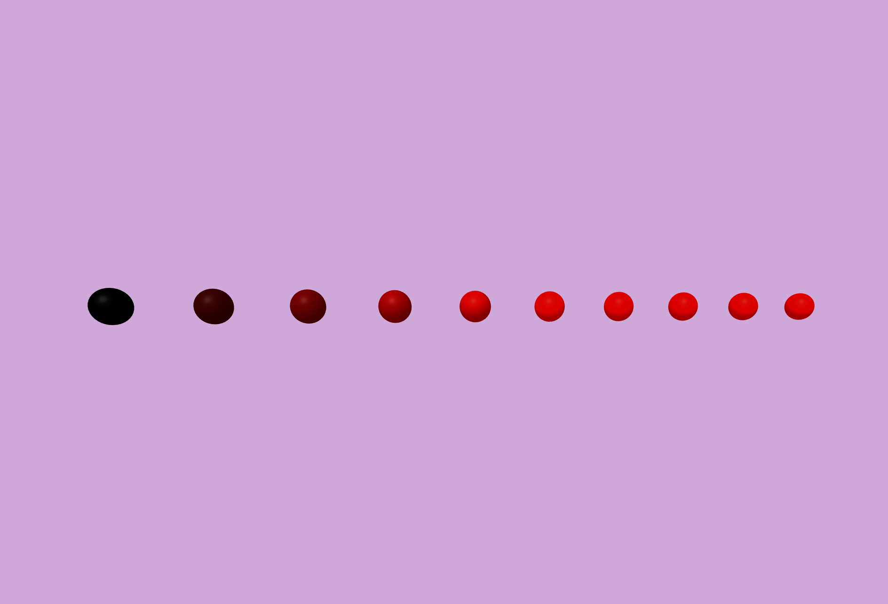

export { default as theme } from '../theme'
import { Image, Appear, Notes } from 'mdx-deck'
import { SplitRight } from 'mdx-deck/layouts'
import PresentButton from '../PresentButton'

# VR & AR On The Web Using ClojureScript

## Andrés Cuervo
### Clojure/Conj 2018
#### November 29, 2018

---

I'm an XR artist, software engineer, and HCI researcher.


---



---



[Codepen](https://codepen.io/mozillavr/pen/BjygdO)

---


---



---


---



---

# `CLJSJS`!

---

<!--
CLJSJS exists to solve one problem: making it easy to get foreign-libs into Clojurescript!

A `foreign lib` is anything that needs to be compiled alongside Clojurescript code.

The most popular example is probably React in projects like Om or Reagent

Let's say you have some Javascript like a simple calculator app
-->


---


---

<!-- How do we go from foreign-lib to CLJSJS? -->

## What do you need to create a `:foreign-lib`?

<ul style={{fontSize: "4rem"}}>
    <li>the development version of the library</li>
    <li>the production version of the library</li>
    <li>an externs file</li>
</ul>

---


(from [JavaScript Module Support (Alpha)](https://clojurescript.org/reference/javascript-module-support) )

---



---



---

<!-- A&#45;Frame does a lot of things, including: networking, webGL handling, polyfilling, normalizing device APIs, its own component system &#38; so much more ... all to give us webVR that works everywhere! -->
<!--  -->

---

# Externs are huge for complex libraries

## 1,894 — react.ext.js
## 24,956 — aframe.ext.js

---

<!-- So, I obviously didn't do this all by hand — I used a generator! David Nolen has done excellent work on externs inference & jmmk on Github has turned this into a simple to use extern generator! -->

[`jmmk`'s externs generator](https://github.com/jmmk/javascript-externs-generator)


---

<!-- So that gets us all the way through CLJSJS, covering how to roll up Javascript & Clojurescript together via CLJSJS -->

> `[cljsjs.aframe :as aframe]`


---

# Functional XR

---


---


---

# VR



---

# ✨ The future! ✨

---

# #1: Standardized around the immersive web
## (long term)

---

#### The [Immersive Web Working Group](https://immersive-web.github.io/webxr/) is working on the WebXR Device API:


---

# #2: Get Javascript modules out of alpha
## (medium term)

---

[JavaScript Modules (Alpha)](https://clojurescript.org/guides/javascript-modules)


---

# #3: Extend to AR!
## (short term)

---

# [`three.ar.js`](https://github.com/google-ar/three.ar.js)


---

# [`aframe-ar`](https://github.com/chenzlabs/aframe-ar) is A-Frame + three.ar.js

```
<a-scene ar>
...
</a-scene>
```

---
<!-- And then the big reveal, of functional AR all using ClojureScript!  -->


---


<div style={{fontSize: "5rem"}}>
<h3>Thanks! Questions?</h3>
<ul>
    <li><a style={{color: "black"}} href="https://twitter.com/acwervo">@acwervo</a></li>
    <li><a style={{color: "black"}} href="https://cwervo.com">cwervo.com</a></li>
    <li><a style={{color: "black"}} href="https://slides.cwervo.com">slides.cwervo.com</a></li>
    <li><a style={{color: "black"}} href="https://github.com/AndresCuervo/testing-aframe-cljsjs">Example A-Frame + CLJSJS project</a></li>
</ul>
</div>
