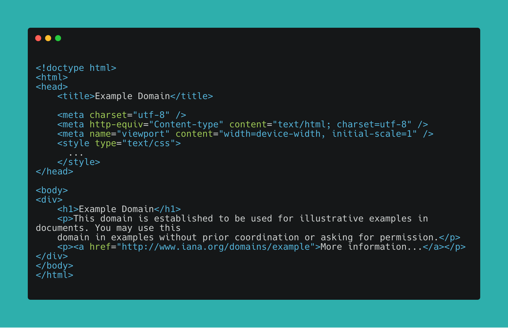
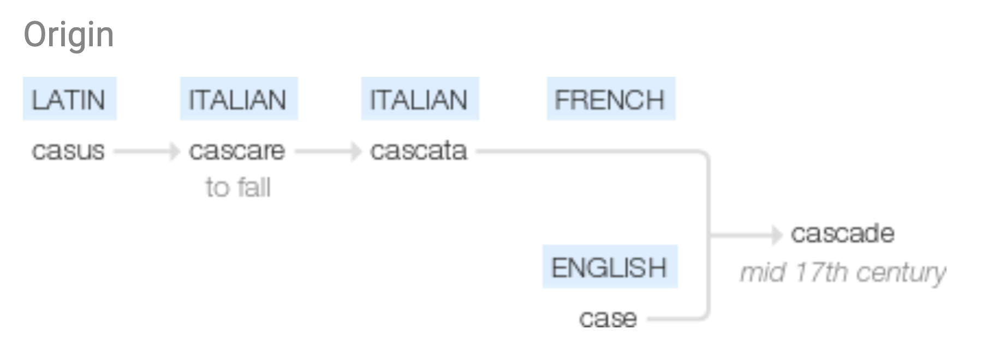
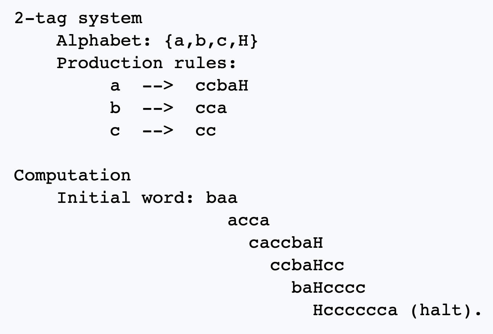

export { default as theme } from '../theme'
import { Image, Appear, Notes } from 'mdx-deck'
import { SplitRight } from 'mdx-deck/layouts'
import PresentButton from '../PresentButton'

# Why do we call HTML tags "tags"?

## Andrés Cuervo
### CSS Conf EU 2019
#### May 31, 2019, 10:00AM

---

I'm an XR artist, software engineer, and HCI researcher.

---

# What are "tags" in HTML?

---

_Source from example.com_

---

# A short trip through the history of HTML

---

# [_Hypertext Markup Language - 2.0_](https://tools.ietf.org/html/rfc1866)

- Document standardizing HTML, though had been in use since ~1990
- Published by Tim Berners-Lee in November 1995
- States: "HTML documents are SGML documents with generic semantics that are
   appropriate for representing information from a wide range of
   domains."

---

# SGML? SGML!

- A general document markup langauge standardized in 1986
- Two types of entites:
    - Type-valid, essentially "doctypes" for each document
    - Tag-valid, where every piece of information has a surrounding XML "tag"

---

# GML

- Predecessor to SGML
- Like SGML, created by Charles F. Goldfarb at IBM
- [In 1969 he was already using the word "tags"](http://www.sgmlsource.com/history/roots.htm), as in:
> "using an un-filled-in outline of tags as a prompter from which to create a new document"
- "tags" === "container for data"

---

# Tracing "tags" so far:

# GML (1969) ➡️   SGML (1986) ➡️  HTML (1995)

---

# So, where did "tag" in 1969 come from?

---

# Introducing, etymology!

---

# Etymology

> "the study of the origin of words and the way in which their meanings have changed throughout history."

---

# e.g. "cascade"

---

# What's the earliest use of "tag" in computing?

---

# Emil Leon Post

---

# First instance of "tag"

- _Formal Reductions of the General Combinatorial Decision Problem_ (**1943**)
- Post introduces a "tag system", a computational model for producing words from production rules

---

# Example:

---

# Why "tags"?

- Footnote on page 12 suggests it comes from the children's game of "tag"!

    

- "Tag" here refers axioms "chasing" each other in order to produce the next word

---

## The etymology chain of "tag"

# tag, children's game (1600's) ➡️
# Emil Post/B.P. Gill (1943) ➡️
# GML (1969) ➡️ 
# SGML (1986) ➡️ 
# HTML (1995)
# 

---

<h3>Thanks!</h3>
<ul>
    <li><a style={{color: "black"}} href="https://twitter.com/acwervo">@acwervo</a></li>
    <li><a style={{color: "black"}} href="https://cwervo.com">cwervo.com</a></li>
    <li><a style={{color: "black"}} href="https://slides.cwervo.com">slides.cwervo.com</a></li>
    

</ul>

