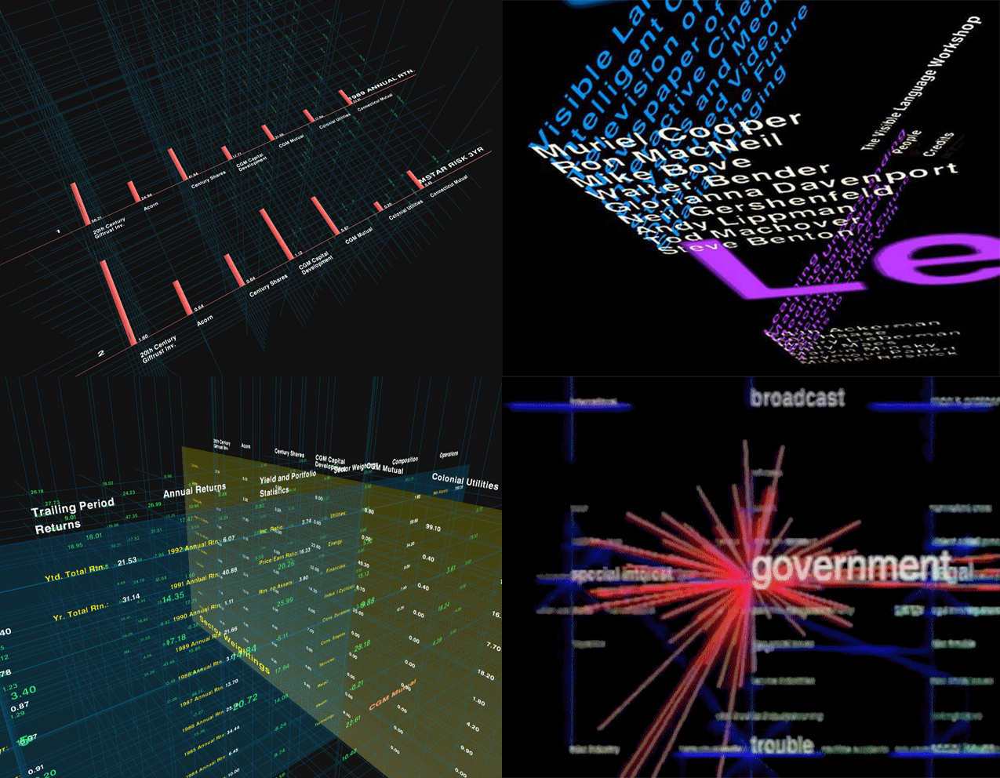

export { default as theme } from '../../theme'
import { Image, Appear, Notes } from 'mdx-deck'
import { SplitRight } from 'mdx-deck/layouts'
import PresentButton from '../../PresentButton'

<!--

Possible chronological ordering for presentation:
- tinguely art piece
- muriel cooper
- Dynamicland
- Chalktalk
-->

# _Lace_
## Andr&eacute;s Cuervo

<PresentButton/>

---

### 👋🏼 I'm Andrés Cuervo

I'm an AR prototyper, HCI researcher, and artist.

Recently I've worked on: VR narratives, art installations, & web AR tools for creativity.

---

# Some guiding ideas

---

- screens
- screenless
- screenlessness
- room-sized
- holdable/habitable

---

- designing for multiple people

---

- art
- interaction
- speculative design

---

# Inspirations

---

> This machine is spectacular because it's a sculpture, a picture, make picture, make sounds, it's an accompanist, a poet, it's a declaration, **this machine is a situation**.

— Jean Tinguely, [_Homage To New York_](https://www.youtube.com/watch?v=0MqsWqBX4wQ&t=3s) (1960)

---

Muriel Cooper, _Information Landscapes_ (1994)

"This stands as a sketch for the future." - [Muriel Cooper](http://www.dextersinister.org/MEDIA/PDF/Thisstandsasasketchforthefuture.pdf)

---

# [Dynamicland](https://dynamicland.org/)

---

# [Chalktalk](https://github.com/kenperlin/chalktalk)

---

Lace is an interactive installation that uses projected light & hand gestures to imagine a world where interacting with technology feels like play.

---

# Technology

- Open Frameworks (graphics)
- Leap Motion (hand detection)
- Epson - Home Cinema 1060 1080p 3LCD Projector

---

# Process

Projector + tripod = screenless (?)

---

---

<video loop muted="true" autoplay="true" playsinline src="assets/LaceAll/2018-08-22-Lace-Leap-Projector-Test_trimmed_to_waves.mp4" style={{ display: "block", marginLeft: "auto", width: "60%", marginRight: "auto"}}></video>

<video loop muted="true" autoplay="true" playsinline src="assets/LaceAll/Animated%20GIF-original.mp4" style={{ display: "block", marginLeft: "auto", width: "60%", marginRight: "auto"}}></video>

---

<video loop muted="true" autoplay="true" playsinline src="assets/LaceAll/ash_test.mp4" style={{ display: "block", marginLeft: "auto", width: "100%", marginRight: "auto"}}></video>

---

# Desired Outcomes

- A system that people can walk up to & interact with, without explanation
- 1 - 3 experiences that get people excited/thinking about a screenless future

---

# Challenges

- Making it intuitive to interact with
- Making it robust (to lighting, hand speed, hand size, etc.)
- Creating a self-explanatory narrative around the experience
- Making a natural gesture/interface to switch between experiences

---

# Timeline

- End of October: 1 experience prototyped (drawing)
- Middle of November: 3 experiences prototyped
- End of November: Polished UX, way to switch between experiences

---

<h3>Thanks!</h3>
<ul>
    <li><a href="https://twitter.com/acwervo">@acwervo</a></li>
    <li><a href="https://cwervo.com">cwervo.com</a></li>
    <li><a href="https://slides.cwervo.com/mdx-slides/gray-area-slides/peer-critique-2/?mode=#0">slides for this talk</a></li>
</ul>

