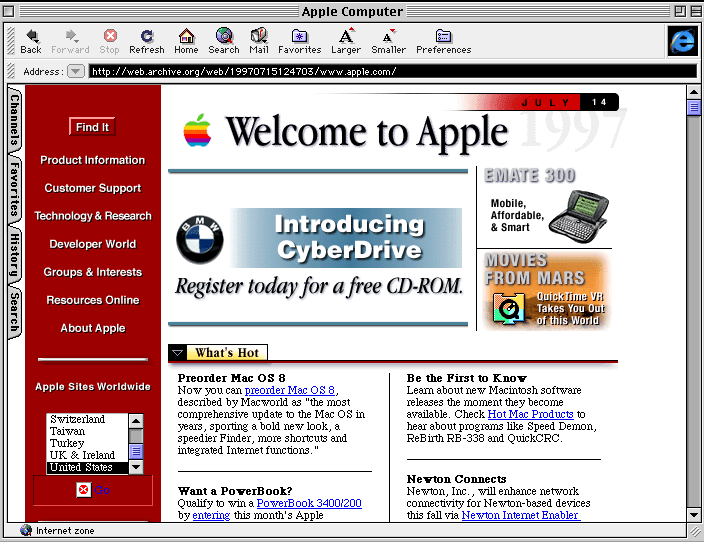
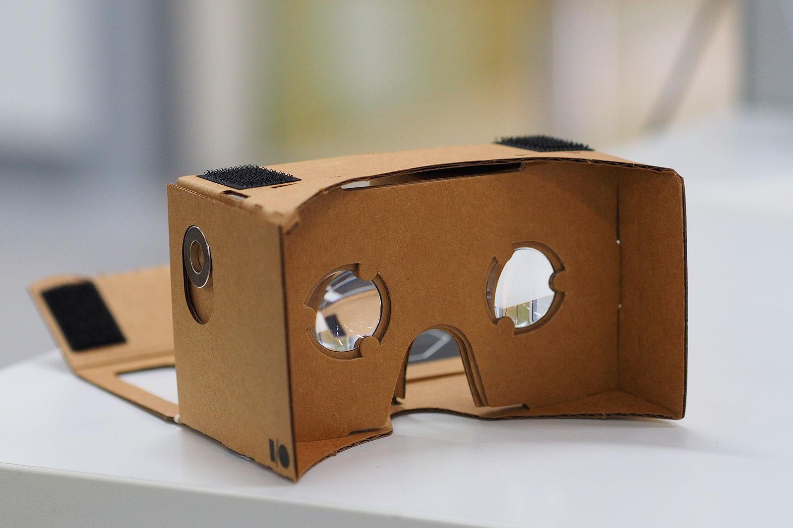
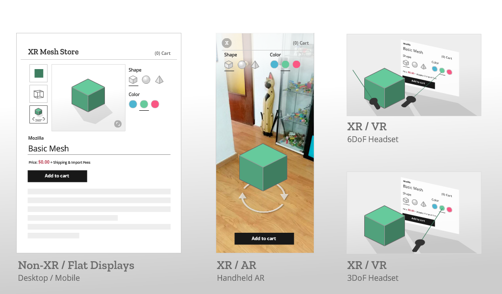
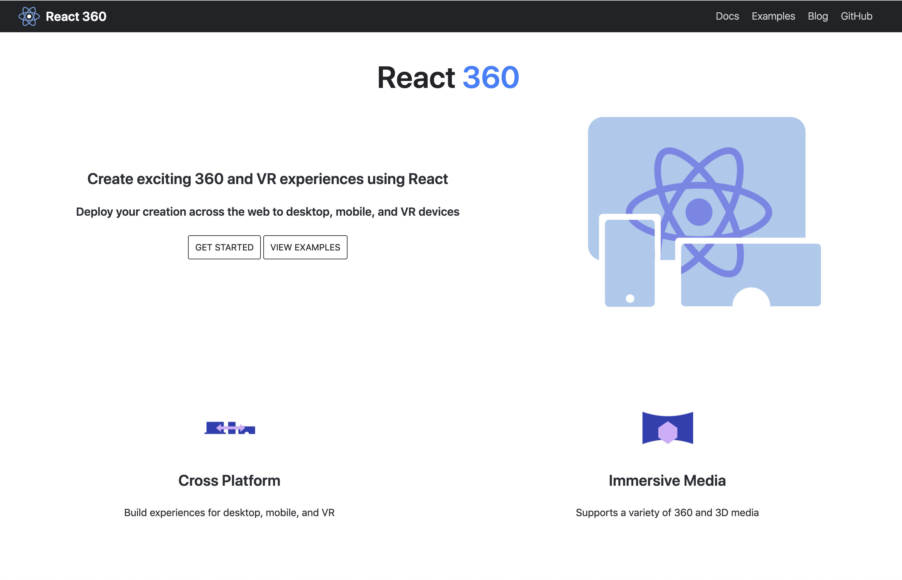
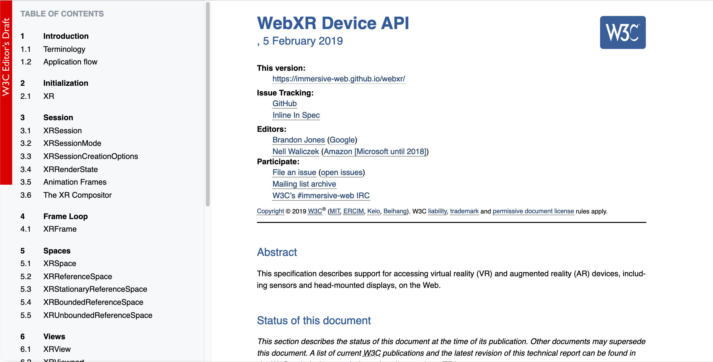

export { default as theme } from '../theme'
import { Image, Appear, Notes } from 'mdx-deck'
import { SplitRight } from 'mdx-deck/layouts'
import PresentButton from '../PresentButton'

# The Immersive Web in 2019

## Andrés Cuervo
### JSConf Hawai'i 2019
#### February 7, 2019, 10:30AM

---

# Part 1: Pre-2019

---

source: <a href="https://css-tricks.com/look-back-history-css/">CSS Tricks | A Look Back at the History of CSS</a>

---

<a href="https://blog.hubspot.com/marketing/parallax-design-good-or-bad">[source]</a>

---

<video muted autoplay="true" loop style={{height: '90vh'}} src="./assets/threejs-examples.mp4"></video>

<a href="https://threejs.org/examples/">threejs.org/examples</a>

---

<h1>2014: Google Cardboard</h1>

<a href="https://en.wikipedia.org/wiki/File:Assembled_Google_Cardboard_VR_mount.jpg">[source]</a>

---

<h1>"true" VR</h1>
<video muted autoplay="true" loop style={{height: '70vh'}} src="./assets/VR.mp4"></video>

<a href="http://prostheticknowledge.tumblr.com/post/127968776656/archaeological-data-visualized-with-htc-vive-dev">[source]</a>

---

# WebVR!

---

[Codepen](https://codepen.io/mozillavr/pen/BjygdO)

---

---

# Sweet, but what about ...

---

<h1>Pok&eacute;mon GO (July 2016!)</h1>
<video muted autoplay="true" loop style={{height: '80vh'}} src="./assets/pkmngo.mp4"></video>

---

<h1> Hololens (March 2016) </h1>
<video muted autoplay="true" loop style={{height: '70vh'}} src="./assets/hololens.mp4"></video>

<a href="http://prostheticknowledge.tumblr.com/post/139870591941/actiongram-leaked-video-demos-app-designed-for">[source]</a>

---

<h1>Magic Leap (August 2018)</h1>
<video muted autoplay="true" loop style={{height: '70vh'}} src="./assets/magic-leap.mp4"></video>
<a href="https://twitter.com/utopiah/status/1092825611880542208?s=21">[source]</a>

---

<h1>So many devices, including desktop!</h1>

source: <a href="https://blog.mozvr.com/progressive-webxr-ar-store/">Progressive WebXR by Arturo Paracuellos</a>

---

# (2018)

# _Immersive Web_ Working Group in the W3C

# ~~WebVR 1.0~~ WebXR Device API

---

# Part 2: The Immersive Web in 2019

---

<h1>A-Frame</h1>

---

<h2>React VR React 360 </h2>

---

<h1>8th Wall (WebAR)</h1>
<video muted autoplay="true" loop style={{height: '85vh'}} src="./assets/8th-wall-scandy.mp4"></video>
<video muted autoplay="true" loop style={{height: '85vh'}} src="./assets/8th-wall-happynewyear.mp4"></video>

---

# Part 3: The Near-Future

---

<a style={{fontSize: '4.5rem'}} href="https://immersive-web.github.io/webxr/">https://immersive-web.github.io/webxr/</a>

---

# WebARonARKit/Core (Google)

</img>

---

# WebXR iOS App (Mozilla)

</img>

---

# One more thing ...

---

<a style={{fontSize: '7rem'}} href="highvoltagehibisc.us"> highvoltagehibisc.us </a>

---

<h3>Thanks! Questions?</h3>
<ul>
    <li><a style={{color: "black"}} href="https://twitter.com/acwervo">@acwervo</a></li>
    <li><a style={{color: "black"}} href="https://cwervo.com">cwervo.com</a></li>
    <li><a style={{color: "black"}} href="https://slides.cwervo.com">slides.cwervo.com</a></li>
</ul>

