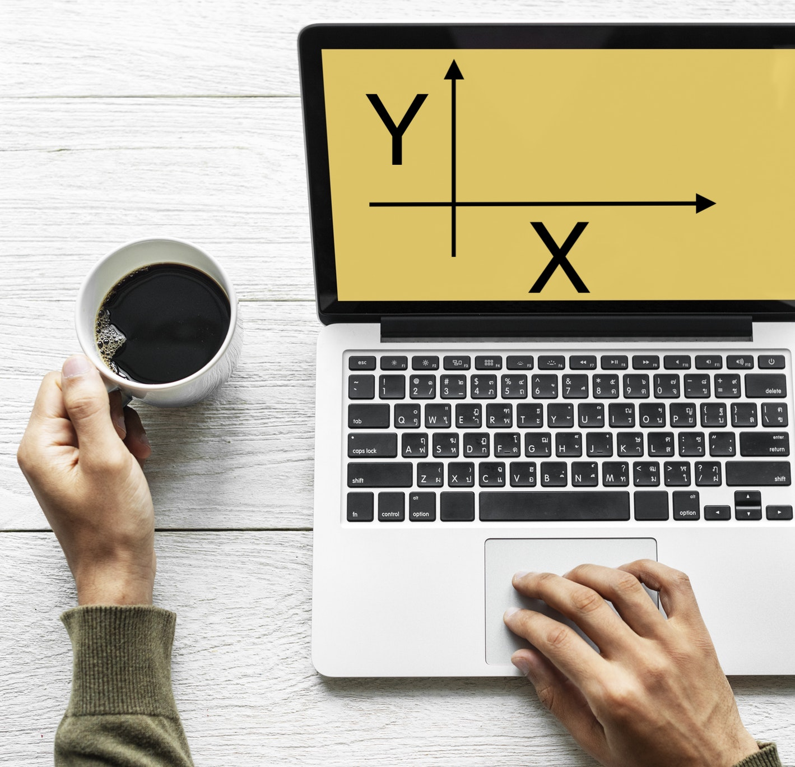
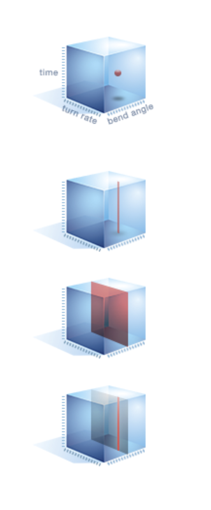
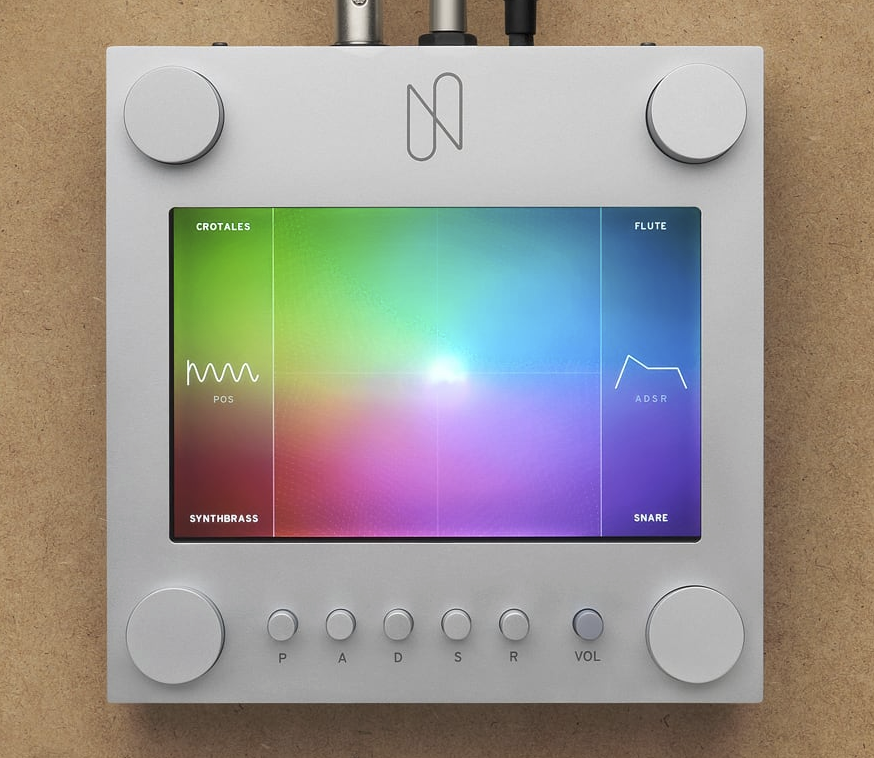

export { default as theme } from '../theme'
import { Image, Appear, Notes } from 'mdx-deck'
import { SplitRight } from 'mdx-deck/layouts'
import PresentButton from '../PresentButton'

# Multidimensional
# UI

## Andrés Cuervo
## Mini 1 '19

### 2018-01-11

---

# Publish!

---

# ... Draft?

---

# ... Okay, research!

---

# 1D

---

---

# 2D

---

[source](https://unsplash.com/photos/piBwkYOFtyU)

---

# 3D ...

---

---

[Ladder of Abstraction by Bret Victor](http://worrydream.com/#!2/LadderOfAbstraction)

---

# 4D +

---

[NSynth by Magenta @ Google](https://nsynthsuper.withgoogle.com)

---

<h3>Thanks! Questions?</h3>
<ul>
    <li><a style={{color: "black"}} href="https://twitter.com/acwervo">@acwervo</a></li>
    <li><a style={{color: "black"}} href="https://cwervo.com">cwervo.com</a></li>
    <li><a style={{color: "black"}} href="https://slides.cwervo.com">slides.cwervo.com</a></li>
</ul>

