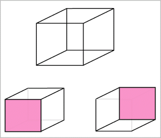
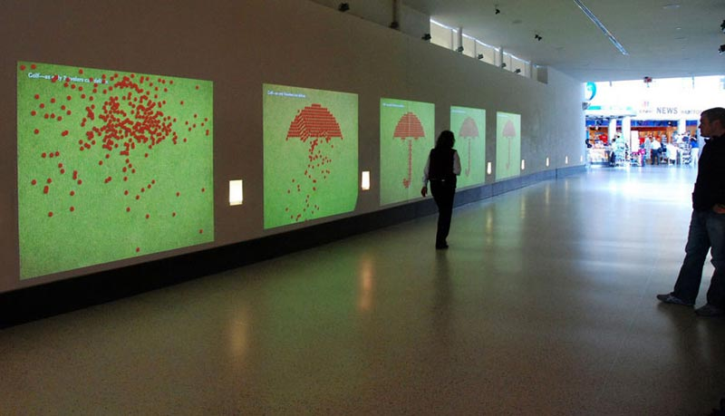
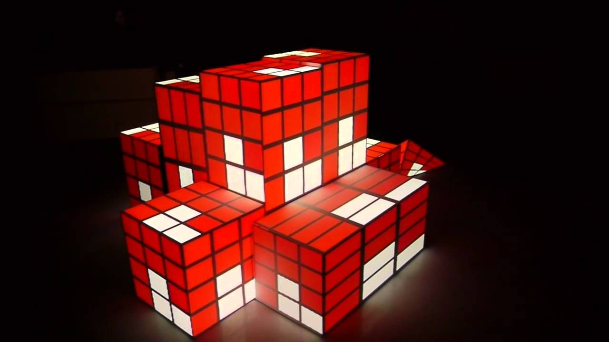
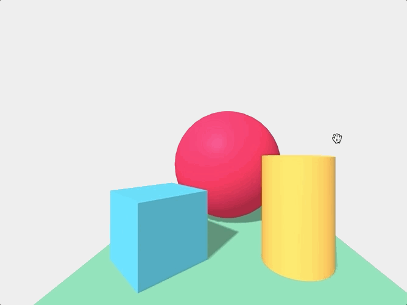
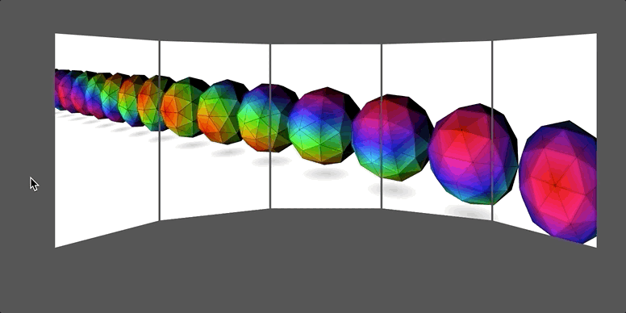

export { default as theme } from '../theme'
import { Image, Appear, Notes } from 'mdx-deck'
import { SplitRight } from 'mdx-deck/layouts'
import PresentButton from '../PresentButton'

<!--

Possible chronological ordering for presentation:
- tinguely art piece
- muriel cooper
- Dynamicland
- Chalktalk
-->

# Lace (2018) + Some Stuff I've Been Thinking About
## Andrés Cuervo
### WebXR Meetup, Tuesday, 2018-12-11

---

# [Lace](https://cwervo.com/lace/)

- Leap Motion 3D controller
- OpenFrameworks (C++)
- Projection "mapped" onto a table
- Projected onto black fabric, made projections pop

---

<video style={{height: '100vh'}}  autoplay="true" loop controls src="./assets/LACE_demonstration.mp4" alt="" />

---

---

---

---

---

# Thinking about cubes ... ambiguous objects:

[source](https://neurochannels.blogspot.com/2009/09/consciousness-6-reversible-figures.html)

---

# Which means this ...

[source](http://www.hrt-me.com/interactive-wall.htm)

---

# is the same as _this_:

[source](https://www.youtube.com/watch?v=P1az8bbuOLg)

---

### What do you get by treating displays as just quads?

[source](https://www.instagram.com/p/BUsdn43jv4S/?utm_source=ig_share_sheet&igshid=ezoi70zdlfnd)

---

# How to do this on the web?

---

# A-Frame Prototype

---

# [Three.js Multiple Views](https://threejs.org/examples/webgl_multiple_views.html)

---

# [Three.js For Multiple Displays](https://threejs.org/examples/?q=mul#webgl_multiple_canvases_circle)

---

# Filament!

#### [Suzanne PBR](https://google.github.io/filament/webgl/demo_suzanne.html), all WebGL/Wasm 😍, also [made a version on Glitch](https://filament-test.glitch.me)

<iframe src="https://google.github.io/filament/webgl/demo_suzanne.html" frameborder="0" style={{width: '80vw', height: '65vh'}}></iframe>

---

# What's next?

- Lace 2.0 with a distributed rendering solution — probably Three.js, but maybe Filament in the future?
- Instead of 2D projections show the volumetric cube of the drawing !!

---

<h3>Thanks!</h3>
<ul>
    <li><a style={{color: "black"}} href="https://twitter.com/acwervo">@acwervo</a></li>
    <li><a style={{color: "black"}} href="https://cwervo.com">cwervo.com</a></li>
    <li><a style={{color: "black"}} href="https://slides.cwervo.com">slides.cwervo.com</a></li>
</ul>

